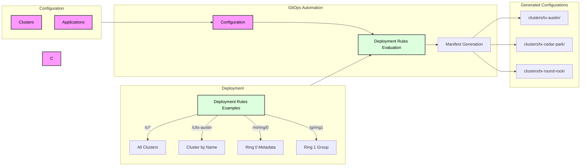
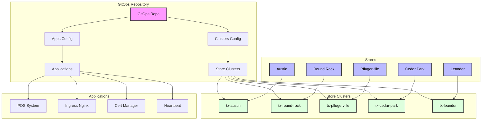

# GitOps Automation

This repository contains the GitOps configurations for managing Kubernetes clusters across multiple retail store locations. Its primary purpose is to automate ring-based deployments of applications across store clusters, allowing controlled rollout of different application versions to specific groups of stores. Rings can be defined either through cluster metadata, enabling flexible deployment strategies. The GitOps Automation tooling combines configuration data with application templates to generate store-specific Kubernetes manifests, with built-in support for rapid rollback in case of deployment issues.

## Configuration Management

### Custom Resource Definitions (CRDs)

The repository uses Custom Resource Definitions (CRDs) to define the structure and validation rules for clusters. CRDs extend the Kubernetes API by defining new, custom resource types that can be managed like built-in Kubernetes objects.

For more information on CRDs, see the [Kubernetes documentation on Custom Resources](https://kubernetes.io/docs/concepts/extend-kubernetes/api-extension/custom-resources/).

The following CRDs are defined in `config/crds.yaml`:

- **Cluster CRD**: Defines the structure for cluster configurations in `clusters.yaml`
  - Specifies metadata, networking, and infrastructure details for each retail store cluster
  - Validates cluster-specific configuration parameters

Sample configurations in these YAML files conform to their respective CRD specifications, ensuring consistent and validated configurations across the GitOps workflow.

### Cluster and Application Versioning

The repository uses GitOps Automation (goa), a powerful command-line tool that streamlines the process of managing Kubernetes configurations in a GitOps workflow. It merges configuration data with K8s templates to populate the GitOps repository efficiently.

#### Key Features

- **Configuration Management**: Merges configuration data with Kubernetes templates
- **Cluster Management**: Lists and manages Kubernetes clusters
- **Application Management**: Lists and manages applications across clusters
- **Expression Evaluation**: Supports complex expression evaluation in configurations
- **Dry Run Support**: Tests changes before applying them
- **Multi-threading**: Optimized performance for large-scale deployments
- **YAML Support**: Native YAML input/output support

### Application Templates

The `apps/` directory contains Kubernetes manifest templates that are used to deploy applications to each cluster. These templates leverage Kustomize, a powerful Kubernetes native configuration management tool, allowing multiple versions of applications to coexist and be deployed to different customers. The templates are processed by the GitOps automation process and combined with version information from `apps.yaml` to generate the final manifests for each cluster.

Using Kustomize with Flux is considered a best practice in GitOps workflows, as it provides powerful capabilities like:
- Base and overlay configurations for different environments
- Strategic merge patches for customization
- ConfigMap and Secret generators
- Resource transformers for consistent modifications

For more information on using Kustomize with Flux, see the [Flux documentation on Kustomize integration](https://fluxcd.io/flux/components/kustomize/kustomization/).

Key applications include:
- **POS System**: Point of Sale application for retail operations
- **Ingress Nginx**: Kubernetes ingress controller for routing traffic
- **Cert Manager**: SSL/TLS certificate management
- **Heartbeat**: Health monitoring and status reporting

### Deployment Rules

Applications are mapped to clusters using expressions in the `kustomization.yaml` files:

Expressions are formulas to determine which clusters apply to that expression

a token beginning with /c matches the cluster. /c/cluster.Name matches the one cluster with that name. /c/* matches all clusters.

The logical operators and, or, not are valid tokens. Parenthesis are supported for evaluation ordering.

A token beginning with /m is a metadata token. The full format is /m/key/value where key exists in the clusters metadata and the value matches. Key and value matching are case sensitive.

Examples
- `/c/*`: Deploys to all clusters
- `/m/ring/0`: Deploys to clusters with metadata `ring: 0`
- `/c/tx-austin`: Deploys to the cluster with name `tx-austin`
- Combining expressions
  - `/m/ring/0 or /m/ring/1`
  - `/m/ring/0 or /c/tx-lockhart`
  - `/m/ring/0 and /m/oven/ACME5000`
- Additional expressions can be defined for specific deployment patterns

#### Process Flow

1. The GitOps automation process reads the configuration files
2. Evaluates the expressions against cluster metadata
3. Generates the appropriate Kubernetes manifests
4. Saves the results in the `/clusters` directory
5. Each store gets its own subdirectory with its specific configuration



## Architecture

The following diagram illustrates how the GitOps repository is deployed to retail stores in the Austin area:



## Components

### Applications

- **POS System**: Point of Sale application for retail operations
- **Ingress Nginx**: Kubernetes ingress controller for routing traffic
- **Cert Manager**: SSL/TLS certificate management
- **Heartbeat**: Health monitoring and status reporting

### Store Clusters

Each retail store location has its own Kubernetes cluster, managed through GitOps. The clusters are named according to their location (e.g., `tx-austin`, `tx-round-rock`).

### GitOps Implementation

This repository uses Arc enabled GitOps (Flux) for GitOps implementation, which:
- Continuously monitors the repository for changes
- Automatically syncs configurations to the appropriate clusters
- Maintains the desired state of all store environments
- Provides audit trail of all changes

## Getting Started

### Prerequisites
- Kubernetes cluster
- Flux CD installed
- kubectl configured

### Deployment
- Clone this repository
- Install GitOps Automation CLI

```bash

# uninstall if necessary
dotnet tool uninstall -g GitOpsAutomation

# install the latest version
# (version '0.4.0')
dotnet tool install -g GitOpsAutomation

```

- Configure Arc enabled GitOps for your cluster

```bash

# change to your resource group
export ARC_RG=arc

# use any name from the clusters config directory
export ARC_NAME=tx-austin

# make sure that PAT is set to a valid GitHub Personal Access Token with permissions to the repository
echo $PAT

# create flux and kustomization
az k8s-configuration flux create \
  --url https://github.com/bartr/tlt \
  --https-key $PAT \
  --cluster-name $ARC_NAME \
  --resource-group $ARC_RG \
  --cluster-type connectedClusters \
  --interval 1m \
  --kind git \
  --name gitops \
  --namespace flux-system \
  --scope cluster \
  --timeout 3m \
  --https-user gitops \
  --branch main \
  --kustomization \
      name=flux-listeners \
      path=./clusters/$ARC_NAME/flux-system/listeners \
      timeout=3m \
      sync_interval=1m \
      retry_interval=1m \
      prune=true \
      force=true

```

- Apply the cluster-specific configurations

```bash

# update the yaml files in the config directory if desired

goa gen

git add .
git commit -am "updated GitOps"
git push

```

- Monitor the deployment through Arc

## Contributing
- Create a new branch for your changes
- Make your changes
- Submit a pull request
- Ensure all tests pass
- Get approval from maintainers

## Security
- Access to the repository is restricted
- All changes require review and approval

## Support
For support, please create an issue in this repository
